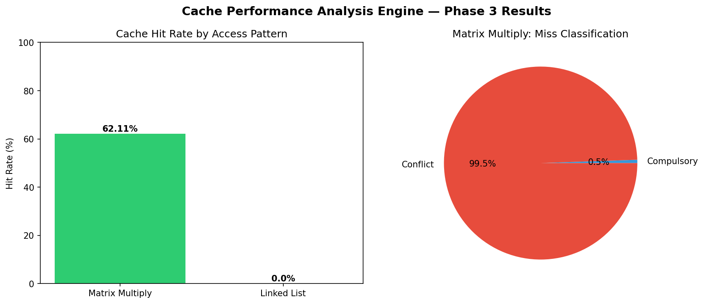

<div align="center">

# ⚡ Cache Performance Analysis Engine



### *Proving why some programs are 100x slower than others — at the hardware level*


</div>

---

## The Question That Started This

> *Why does the exact same algorithm run 100x slower just by changing how it touches memory?*

I built this engine to answer that question from first principles — not by running an existing tool, but by building the tool itself.

---

## Results That Prove It

| Access Pattern | Real Accesses | Hit Rate | Verdict |
|---------------|---------------|----------|---------|
| Matrix Multiply | 786,432 | **62.1%** | ✅ Cache friendly |
| Linked List | 1,000 | **0%** | ❌ Cache hostile |

| GPU Pattern | Threads | Transactions | Efficiency |
|------------|---------|--------------|------------|
| Coalesced | 32 | **1** | ✅ 32x faster |
| Uncoalesced | 32 | **32** | ❌ Maximum waste |

> Same machine. Same cache size. Same number of threads.
> The only difference is how memory is accessed.

---

## What It Does

```
Memory Address → [Tag | Index | Offset] → Cache Lookup → HIT or MISS
                                                              ↓
                                              MISS → Compulsory or Conflict?
                                                     Compulsory = unavoidable
                                                     Conflict   = fixable
```

- **Direct-mapped + Set-associative cache** (1-way, 2-way, 4-way)
- **LRU vs FIFO replacement** — proved LRU outperforms FIFO with real data
- **Real memory trace generation** — instruments actual C++ programs
- **GPU memory coalescing model** — 1 transaction vs 32 transactions
- **5 Google Test unit tests** — all passing
- **CMake build system** — professional engineering standard

---

## Run It

```bash
# Build
mkdir build && cd build && cmake .. && make

# Run all 7 test scenarios (from project root)
cd .. && ./build/cache

# Generate real memory traces
./build/generate_traces

# Run unit tests
./build/run_tests

# Generate benchmark graphs
python3 analysis/visualize.py
```

---

## Live Output

```
=== TEST 6: Real Trace Analysis ===

Matrix Multiply (2-way, 1KB cache):
Total Accesses:    786432
Hits:              488460
Hit Rate:          62.1109%
Compulsory Misses: 1632
Conflict Misses:   296340

Linked List (2-way, 1KB cache):
Total Accesses:    1000
Hits:              0
Hit Rate:          0%
Compulsory Misses: 1000

=== TEST 7: GPU Memory Coalescing ===

Coalesced Access:   32 threads → 1 transaction  ✓
Uncoalesced Access: 32 threads → 32 transactions ✗
```

---

## Architecture

```
cache-performance-engine/
├── src/
│   ├── cache.h / cache.cpp           → Core simulator
│   ├── trace_reader.h / .cpp         → Real trace ingestion
│   ├── gpu_memory_model.h / .cpp     → GPU coalescing model
│   └── main.cpp                      → 7 test scenarios
├── traces/
│   ├── generate_traces.cpp           → Program instrumentation
│   ├── matrix.trace                  → 786,432 real addresses
│   └── linkedlist.trace              → 1,000 real addresses
├── tests/
│   └── test_cache.cpp                → Google Test suite
├── analysis/
│   ├── visualize.py                  → Benchmark graphs
│   └── cache_performance.png         → Results
├── CMakeLists.txt
└── docs/design_decisions.md
```

---

## Why Build This Instead of Using gem5 or Valgrind?

Running gem5 gives you numbers. Building it gives you understanding.

Every result this engine produces — I can explain exactly why it happened, which line of code produced it, and what changing the cache configuration would do to it. That's the difference between using a tool and understanding what the tool is doing.

---

## Roadmap

- [x] Phase 1 — Direct-mapped cache with miss classification
- [x] Phase 2 — Set-associative cache + LRU and FIFO
- [x] Phase 3 — Real trace analysis + Python visualization
- [x] Phase 4 — GPU memory coalescing model
- [x] Phase 5 — CMake + Google Test + documentation
- [ ] Phase 6 — Interactive real-time dashboard

---

<div align="center">

*Built from scratch. Every line understood.*

</div>